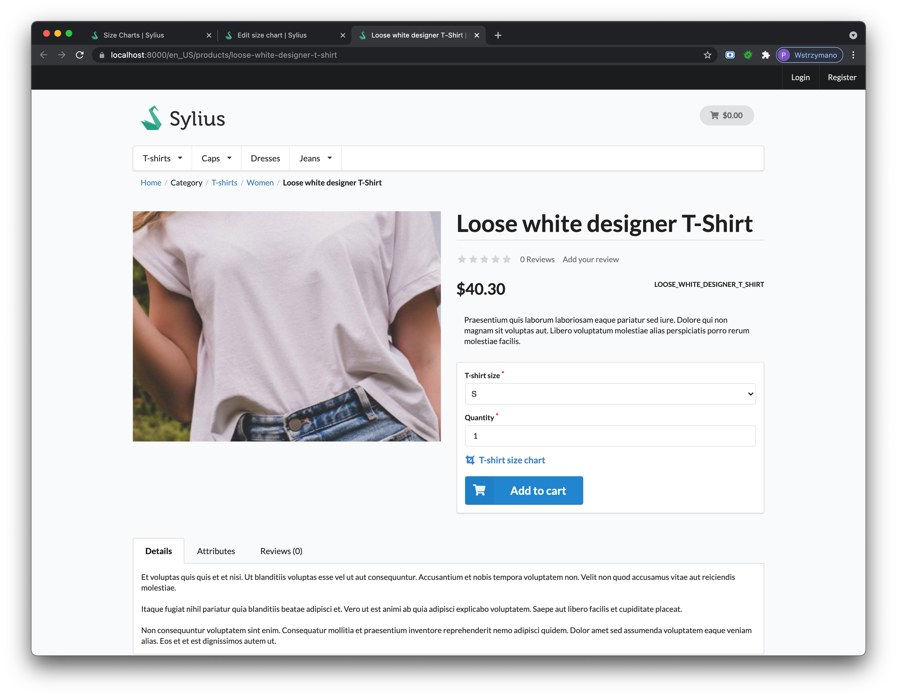
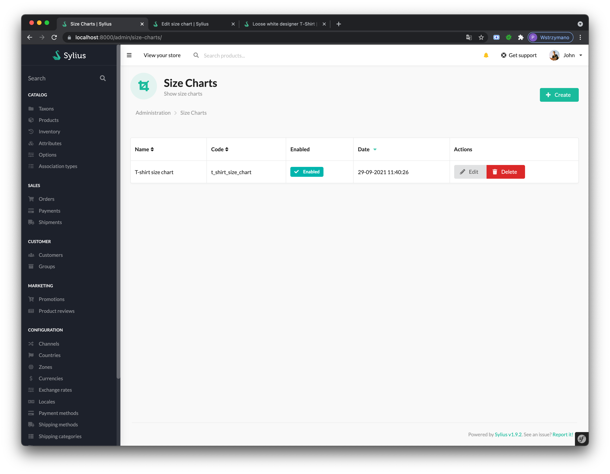
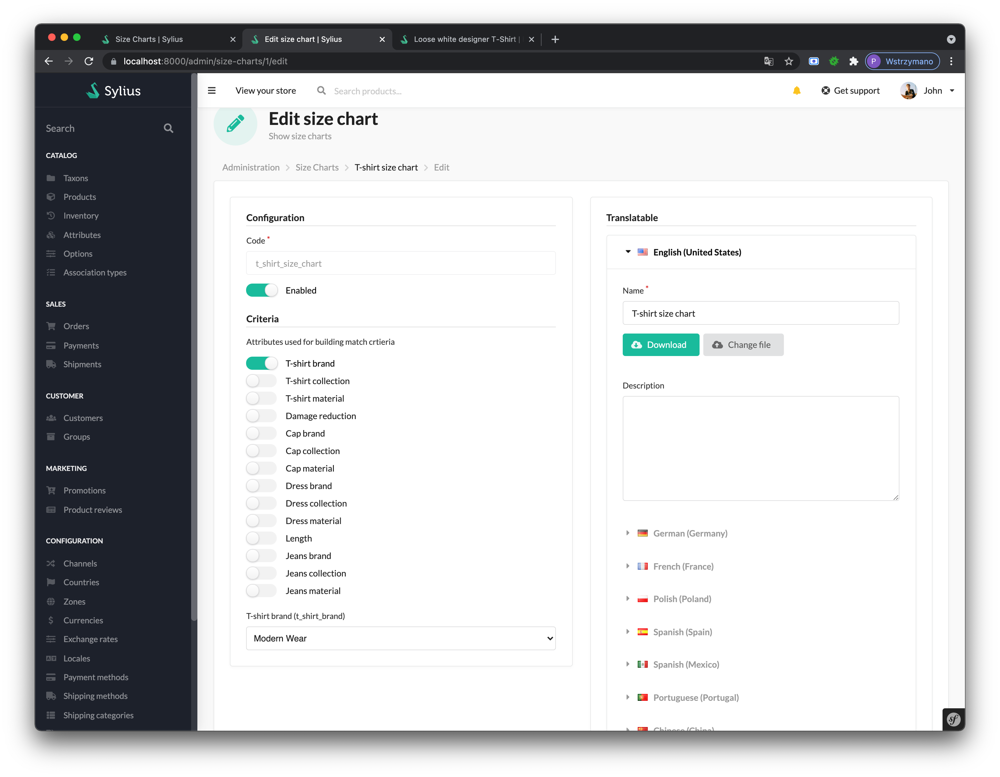

# [Madcoders](https://www.madcoders.co) Sylius Size Chart Plugin

## Features
- upload size chart files (for example for shoes, t-shirts and similar products)
- match size charts by rules (based on the product attributes)
- translatable

## Requirements
| | Version |
| :--- |:--------|
| PHP  | ^8.0    |
| Sylius | ^1.12    |

For Sylius 1.8 support check [Sylius Size Chart Plugin v1.0.x](https://github.com/mad-coders/sylius-sizechart-plugin/tree/1.0).

## Screenshots




## Installation

1. Add as dependency in `composer.json`  
```shell
composer require madcoders/sylius-sizechart-plugin
```

2. Enable plugin in `config/bundles.php`:  
```php
Madcoders\SyliusSizechartPlugin\MadcodersSyliusSizechartPlugin::class => ['all' => true],
```    

3. Import required config in `config/packages/_sylius.yaml` file:
```yaml
imports:
    - { resource: "@MadcodersSyliusSizechartPlugin/Resources/config/config.yml" }
```  

4. Import routes `config/routes.yaml` file:
```yaml
madcoders_sylius_sizechart_plugin:
    resource: "@MadcodersSyliusSizechartPlugin/Resources/config/routing.yaml"
```
5. Run migrations:
```bash
php bin/console doctrine:migrations:migrate
```

## Development

* See [How to contribute](docs/CONTRIBUTING.md)

## License

This library is under the [EUPL 1.2](LICENSE) license.

## Credits


Developed by [MADCODERS](https://madcoders.co)    
Architects of this package:  
- [Piotr Lewandowski](https://github.com/plewandowski) 
- [Leonid Moshko](https://github.com/LeoMoshko)

<a href="https://www.buymeacoffee.com/madcoders" target="_blank"></a>
